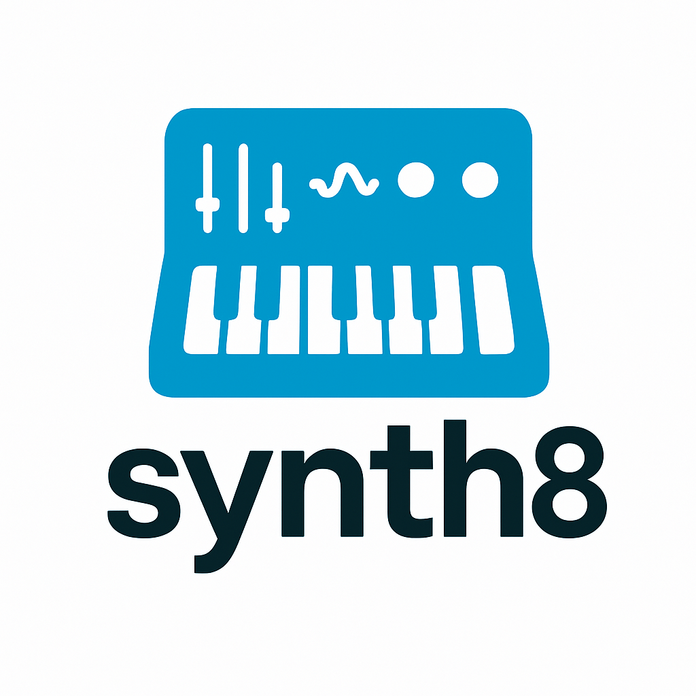
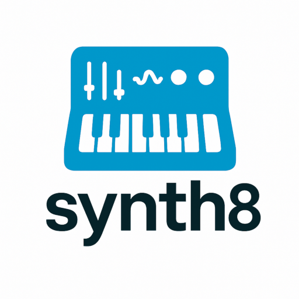

<!--  -->
<p align="center">
  
</p>

# Synth8

A modular synthesizer engine for real-time audio synthesis in Python.

Synth8 lets you build and control polyphonic synthesizers in Python with
modular components: oscillators, envelopes (ADSR), filters, LFOs, keyboard
interaction and more.

You can use Synth8 for:
- learning synthesis concepts programmatically,
- building keyboard-driven instruments,
- composing or experimenting with procedural sound design.

---

## Features

- Real-time audio output via `sounddevice`
- Supports multiple voices (polyphony)
- Built-in waveform types: `sine`, `square`, `saw`
- Customizable ADSR amplitude envelopes
- Low-pass filter per voice
- LFO modulation (frequency vibrato)
- Keyboard key mapping (via `pynput`)
- Terminal-safe control on Unix/Windows

---

## Installation

You need Python 3.8+ and the following packages:

```bash
pip install numpy sounddevice scipy pynput
```

---

## Example 1: Use as a Synth Library

You can use Synth8 to trigger and control sounds directly from code.

```python
from synth8 import SynthVoice, SynthEngine
import time

# Create 3 voices for C major (C, E, G)
voice1 = SynthVoice(); voice1.oscillator(261.63)
voice2 = SynthVoice(); voice2.oscillator(329.63)
voice3 = SynthVoice(); voice3.oscillator(392.00)

for v in [voice1, voice2, voice3]:
    v.adsr(attack=0.05, decay=0.1, sustain=0.6, release=0.5)

# Add to engine
engine = SynthEngine()
engine.add_voice(voice1, id='C')
engine.add_voice(voice2, id='E')
engine.add_voice(voice3, id='G')
engine.play()

# Trigger voices in sequence
engine.voice_on('C'); time.sleep(0.5)
engine.voice_on('E'); time.sleep(0.5)
engine.voice_on('G'); time.sleep(2)

# Release
for vid in ['C', 'E', 'G']:
    engine.voice_off(vid)

time.sleep(1)
engine.stop()
```

## Example 2: Keyboard-Triggered Chord with Mixer

Use the `Mixer` class to play a chord by pressing a single key.

```python
from synth8 import SynthVoice, Mixer, SynthEngine, TerminalSilent
import time

# Frequencies for C major chord: C, E, G
frequencies = [261.63, 329.63, 392.00]
voices = []

for freq in frequencies:
    v = SynthVoice()
    v.oscillator(freq=freq, waveform='saw')
    v.adsr(attack=0.05, decay=0.1, sustain=0.6, release=0.5)
    voices.append(v)

chord = Mixer(voices)

engine = SynthEngine()
engine.add_voice(chord, id='C_MAJ', key='z')
engine.play()

print("Press 'z' to play the chord. Ctrl+C to stop.")
try:
    with TerminalSilent():
        while True:
            time.sleep(0.01)
except KeyboardInterrupt:
    engine.stop()
    print("Goodbye.")
```
---

## License

This project is licensed under the **GNU General Public License v3.0 (GPLv3)**.

See the LICENSE file or visit [https://www.gnu.org/licenses/gpl-3.0.html](https://www.gnu.org/licenses/gpl-3.0.html) for details.

---

## Author

Valerio Poggi — 2025


