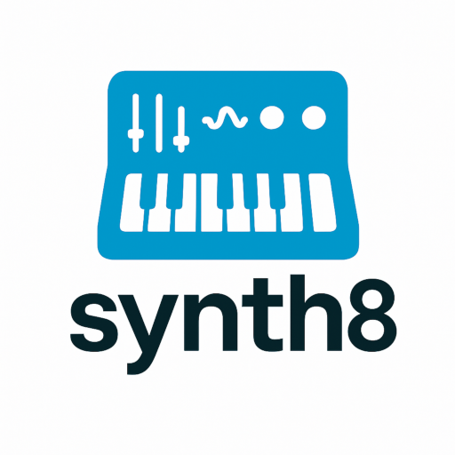

# synth8

[](https://www.gnu.org/licenses/agpl-3.0)
[](https://www.python.org/)
[]()
[](https://github.com/yourname/synth8)

<p align="center">
  
</p>

`synth8` is a modular synthesizer engine implemented in pure Python for real-time sound synthesis.  
It is designed for musicians and developers who want full programmatic control over how sounds are generated, modulated, and triggered.

With `synth8`, you can define signal chains by combining oscillators, filters, VCAs, and modulation sources such as envelopes and LFOs. Each signal chain is managed as a **voice**, which can be triggered by keyboard events or programmatically.  
The architecture is simple, extensible, and designed with future integration (e.g. MIDI via `klavio`) in mind.

---

## Features

- Modular signal architecture: oscillators, filters, amplifiers, modulators
- Real-time low-latency audio output via `sounddevice`
- QWERTY keyboard control with press/release handling
- ADSR envelopes and LFOs for time-based and cyclical modulation
- Fully programmatic voice creation and connection
- Dynamic voice activation and automatic cleanup
- Easily extensible for new signal types or control inputs

---

## Installation

### Requirements

- Python 3.8 or higher
- numpy
- scipy
- sounddevice
- pynput

Install dependencies (if not already available):

```bash
pip install numpy scipy sounddevice pynput
```

### Install from PyPI (planned)

```bash
pip install synth8
```

### Install from source

```bash
git clone https://github.com/yourname/synth8
cd synth8
pip install .
```

For development:

```bash
pip install -e .
```

---

## Library Overview

`synth8` is built around the idea of **modular signal flow**. A central `SynthEngine` manages a collection of independent sound-producing **voices**, each of which is composed of interconnected **nodes** and optionally controlled by **modulators**.

### What is a Voice?

A **SynthVoice** is a self-contained audio processing chain — typically corresponding to a single note or instrument voice — that defines:

- One or more **nodes**: components like oscillators, filters, VCAs
- One or more **modulators**: components that modify parameters over time (e.g., envelopes, LFOs)
- A logical gate state: whether the voice is currently active, controlled by key press/release

Each voice is triggered by a keyboard key or programmatically, and deactivates automatically when its modulation and signal have finished.

### Nodes vs Modulators

**Nodes** are the building blocks of the audio signal path. Each node takes an input signal (or none), processes it, and returns an output. Common node types include:

- `SynthOscillator`: generates waveforms (sine, square, saw)
- `SynthFilter`: applies low-pass filtering to a signal
- `SynthVCA`: controls signal amplitude via gain

**Modulators**, on the other hand, produce control signals that dynamically influence node parameters over time. Typical modulators are:

- `SynthADSR`: attack–decay–sustain–release envelope
- `SynthLFO`: low-frequency oscillator for vibrato, tremolo, etc.

Modulators are connected to node parameters using:

```python
modulator.modulate(target_node, "parameter_name")
```

---

## Usage Examples

### 1. Minimal voice with a sine wave

```python
from synth8 import SynthEngine, SynthVoice, SynthOscillator

osc = SynthOscillator(freq=440, waveform='sine')
voice = SynthVoice()
voice.connect(osc)

engine = SynthEngine()
engine.add_voice(voice, id='note_a', key='z')
engine.play(wait=True)
```

### 2. Add filter and amplifier

```python
from synth8.nodes import SynthFilter, SynthVCA

osc = SynthOscillator(freq=440)
filt = SynthFilter(cutoff=1000)
vca = SynthVCA(gain=1.0)

voice = SynthVoice()
voice.connect([osc, filt, vca])
```

### 3. Apply ADSR envelope and LFO

```python
from synth8.modulators import SynthADSR, SynthLFO

adsr = SynthADSR(attack=0.01, decay=0.1, sustain=0.8, release=0.3)
lfo = SynthLFO(freq=5.0, depth=4.0)

adsr.modulate(vca, "gain")
lfo.modulate(osc, "freq")

voice.add_modulator([adsr, lfo])
```

### 4. Assign to keyboard

```python
engine.add_voice(voice, id="note_c", key="z")
```

Now pressing the Z key will trigger the voice, and releasing it will stop it gracefully.

---

## Full Demos

### Keyboard Piano

Maps QWERTY keys Z to , to notes C4–C5 using independent voices with filter and envelope.

Run:

```bash
python examples/keyboard_piano.py
```

### Static Chord

Creates a chord using multiple oscillators triggered by a single key.

Run:

```bash
python examples/example_chord.py
```

---

## Extending `synth8`

`synth8` is modular by design. You can extend it in several directions:

- Create new signal nodes: bandpass filters, distortion units, custom oscillators
- Add new modulators: sequencers, step envelopes, MIDI-controlled curves
- Integrate with GUI controls or network protocols (e.g. OSC)
- Add MIDI support via the upcoming `klavio` library

The modular structure is lightweight and encourages experimentation with real-time synthesis logic.

---

## License

This project is released under the **GNU Affero General Public License v3.0 (AGPL-3.0)**.

---

## Author

**Valerio Poggi** - 2025
